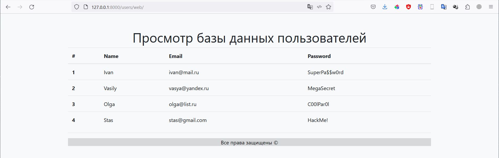

# Фреймворки Flask и FastAPI (семинары)
## Урок 5. Знакомство с FastAPI

### Задание №3
- Создать API для добавления нового пользователя в базу данных. Приложение должно иметь возможность принимать POST запросы с данными нового пользователя и сохранять их в базу данных.
- Создайте модуль приложения и настройте сервер и маршрутизацию.
- Создайте класс User с полями id, name, email и password.
- Создайте список users для хранения пользователей.
- Создайте маршрут для добавления нового пользователя (метод POST).
- Реализуйте валидацию данных запроса и ответа.

### Задание №4

- Создать API для обновления информации о пользователе в базе данных. Приложение должно иметь возможность принимать PUT запросы с данными пользователей и обновлять их в базе данных.
- Создайте модуль приложения и настройте сервер и маршрутизацию.
- Создайте класс User с полями id, name, email и password.
- Создайте список users для хранения пользователей.
- Создайте маршрут для обновления информации о пользователе (метод PUT).
- Реализуйте валидацию данных запроса и ответа.

### Задание №5
- Создать API для удаления информации о пользователе из базы данных. Приложение должно иметь возможность принимать DELETE запросы и удалять информацию о пользователе из базы данных.
- Создайте модуль приложения и настройте сервер и маршрутизацию.
- Создайте класс User с полями id, name, email и password.
- Создайте список users для хранения пользователей.
- Создайте маршрут для удаления информации о пользователе (метод DELETE).
- Реализуйте проверку наличия пользователя в списке и удаление его из списка.

### Задание №6
- Создать веб-страницу для отображения списка пользователей. Приложение должно использовать шаблонизатор Jinja для динамического формирования HTML страницы.
- Создайте модуль приложения и настройте сервер и маршрутизацию.
- Создайте класс User с полями id, name, email и password.
- Создайте список users для хранения пользователей.
- Создайте HTML шаблон для отображения списка пользователей. Шаблон должен содержать заголовок страницы, таблицу со списком пользователей и кнопку для добавления нового пользователя.
- Создайте маршрут для отображения списка пользователей (метод GET).
- Реализуйте вывод списка пользователей через шаблонизатор Jinja.

## Решение

Реализованы методы GET, POST, PUT и DELETE для работы со списком пользователей

Результат находится в файле main.py

## Результат работы

### Добавление информации:

    C:\Users\User>curl -H "accept: application/json" -H "Content-Type: application/json" -X POST http://127.0.0.1:8000/users/ -d "{\"name\": \"Ivan\", \"email\": \"ivan@mail.ru\", \"password\": \"SuperPa$$w0rd\"}"
    {"name":"Ivan","email":"ivan@mail.ru","password":"SuperPa$$w0rd"}
    C:\Users\User>curl -H "accept: application/json" -H "Content-Type: application/json" -X POST http://127.0.0.1:8000/users/ -d "{\"name\": \"Vasily\", \"email\": \"vasya@yandex.ru\", \"password\": \"MegaSecret\"}"
    {"name":"Vasily","email":"vasya@yandex.ru","password":"MegaSecret"}
    C:\Users\User>curl -H "accept: application/json" -H "Content-Type: application/json" -X POST http://127.0.0.1:8000/users/ -d "{\"name\": \"Olga\", \"email\": \"olga@list.ru\", \"password\": \"C00lPar0l\"}"
    {"name":"Olga","email":"olga@list.ru","password":"C00lPar0l"}
    C:\Users\User>curl -H "accept: application/json" -H "Content-Type: application/json" -X POST http://127.0.0.1:8000/users/ -d "{\"name\": \"Stas\", \"email\": \"stas@gmail.com\", \"password\": \"HackMe!\"}"
    {"name":"Stas","email":"stas@gmail.com","password":"HackMe!"}

### Просмотр результата после добавления данных:
    
    C:\Users\User>curl -H "accept: application/json"  -H "Content-Type: application/json" -X GET http://127.0.0.1:8000/users/
    [{"name":"Ivan","email":"ivan@mail.ru","password":"SuperPa$$w0rd"},{"name":"Vasily","email":"vasya@yandex.ru","password":"MegaSecret"},{"name":"Olga","email":"olga@list.ru","password":"C00lPar0l"},{"name":"Stas","email":"stas@gmail.com","password":"HackMe!"}]

### Изменение данных:

    C:\Users\User>curl -H "accept: application/json" -H "Content-Type: application/json" -X PUT http://127.0.0.1:8000/users/2 -d "{\"name\": \"Mike\", \"email\": \"mike@nasa.com\", \"password\": \"IWantToBeleve\"}"
    {"user_id":2,"user":{"name":"Mike","email":"mike@nasa.com","password":"IWantToBeleve"}}

### Просмотр результата после изменения данных:

    C:\Users\User>curl -H "accept: application/json"  -H "Content-Type: application/json" -X GET http://127.0.0.1:8000/users/
    [{"name":"Ivan","email":"ivan@mail.ru","password":"SuperPa$$w0rd"},{"name":"Vasily","email":"vasya@yandex.ru","password":"MegaSecret"},{"name":"Mike","email":"mike@nasa.com","password":"IWantToBeleve"},{"name":"Stas","email":"stas@gmail.com","password":"HackMe!"}]

### Удаление данных

    C:\Users\User>curl -H "accept: application/json" -X DELETE http://127.0.0.1:8000/users/1
    {"user_id":1}

### Просмотр результата после удаления данных:

    C:\Users\User>curl -H "accept: application/json"  -H "Content-Type: application/json" -X GET http://127.0.0.1:8000/users/
    [{"name":"Ivan","email":"ivan@mail.ru","password":"SuperPa$$w0rd"},{"name":"Mike","email":"mike@nasa.com","password":"IWantToBeleve"},{"name":"Stas","email":"stas@gmail.com","password":"HackMe!"}]
    C:\Users\User>

### Отображение результатов на web-странице:

